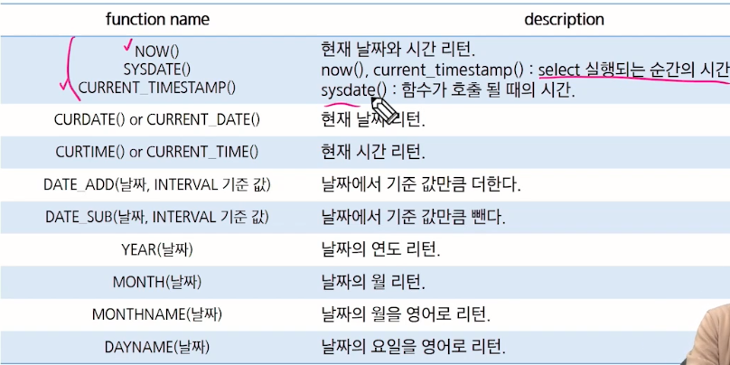
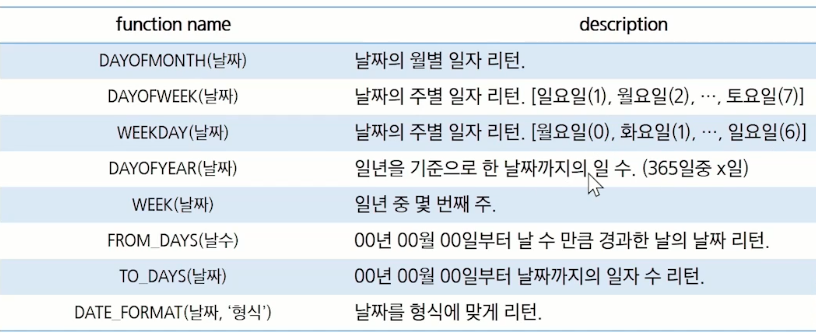
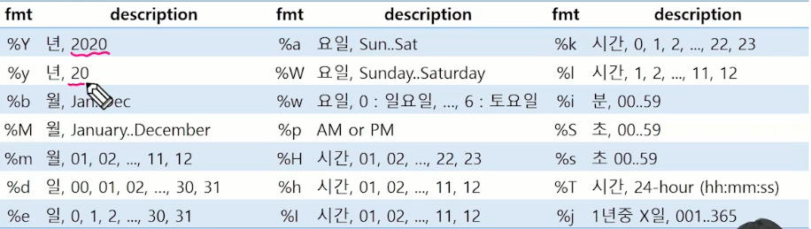
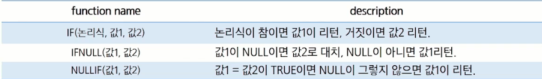
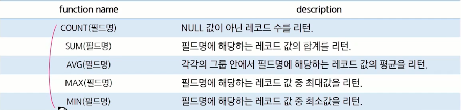

##### RDBMS & SQL

##### RDBMS

- 관계형 데이터베이서 시스템

- 테이블 기반의 DBMS
  
  - 데이터를 테이블 단위로 관리
    
    하나의 테이블은 여러개의 컬럼으로 구성
  
  - 중복 데이터를 최소화 시킴
    
    같은 데이터가 여러 컬럼 또는 테이블에 존재 했을 경우, 데이터를 수정 시 문제가 발생할 가능성이 높아짐 - 정규화
  
  - 여러 테이블에 분산되어 있는 데이터를 검색 시 테이블 간의 관계를 이용하여 필요한 데이터를 검색

- 저장 구조 : table
  
  column(열), row(행)

##### SQL

- 데이터베이스에 있는 정보를 사용할 수 있도록 지원하는 언어

- 모든 DBMS에서 사용 가능

- Query의 대소문자는 구분하지 않음. 단, 데이터의 대소문자는 구분

##### DML(Data Manipulation Language)

데이터 조작어

테이블의 레코드를 CRUD

- SELECT
  
  SELECT, FROM
  
  SELECT * | { [ ALL | DISTINCT] column | expression [alias], ...}
  
  FROM table_name;
  
  | *          | FROM절에 나열된 테이블에서 모든 열을 선택                    |
  | ---------- | -------------------------------------------- |
  | ALL        | 선택된 모든 행을 반환, ALL이 default                   |
  | DISTINCT   | 선택된 모든 행 중에서 중복 행 제거                         |
  | column     | FROM 절에 나열된 테이블에서 지정된 열을 선택                  |
  | expression | 표현식은 값으로 인식되는 하나 이상의 값, 연산자 및 SQL 함수의 조합을 뜻함 |
  | alias      | 별칭                                           |
  
  ```sql
  CASE exp1 WHEN exp2 THEN exp3
            [WHEN exp 4 THEN exp5
            ...
            ELSE exp6]
  END
  ```
  
  ```sql
  SELECT * | { [ ALL | DISTINCT] column | expression [alias], ...}
  FROM table_name;
  WHERE conditions;
  ```
  
  WHERE : 조건에 만족하는 행을 검색
  
  AND, OR, NOT
  
  IN
  
  BETWEEN A AND B
  
  null 비교 : is null, is not null
  
  LIKE : '%'라는 와일드카드 이용해서 찾아야, _ 언더바는 음 자릿수
  
  ORDER BY : 정렬(default: ASC)
  
  

- 내장함수
  
  - 단일행 함수
    
    - 숫자 관련 함수
      
      | function name              | description            |
      | -------------------------- | ---------------------- |
      | ABS(숫자)                    | 절대값                    |
      | CEILING(숫자)                | 값보다 큰 정수 중 가장 작은 수(올림) |
      | FLOOR(숫자)                  | 값보다 작은 정수 중 가장 큰 수(내림) |
      | ROUND(숫자, 자릿수)             | 숫자를 자릿수까지 반올림          |
      | TRUNCATE(숫자, 자릿수)          | 숫자를 자릿수까지 버림           |
      | POW(X, Y) or POWER(X, Y)   | X의 Y승                  |
      | MOC(분자, 분모)                | 분자를 분모로 나눈 나머지         |
      | GREATEST(숫자1, 숫자2, 숫자3...) | 주어진 수에서 가장 큰 수를 반환     |
      | LEAST(숫자1, 숫자2, 숫자3...)    | 주어진 수에서 가장 작은 수를 반환    |
    
    - 문자 관련 함수
      
      | function name                       | description                  |
      | ----------------------------------- | ---------------------------- |
      | ASCII(문자)                           | 문자의 아스키 코드 값 리턴              |
      | CONCAT('문자열1', '문자열2', '문자열3', ...) | 문자열들의 결합                     |
      | INSERT('문자열', 시작위치, 길이, '새로운 문자열')  | 문자열의 시작위치부터 길이만큼 새로운 문자열로 대치 |
      | REPLACE('문자열', '기존 문자열', '바뀔 문자열')  | 문자열 중 기존 문자열을 바뀔 문자열로 변경     |
      | INSTR('문자열', 찾는 문자열)                | 문자열 중 찾는 문자열의 위치 값을 리턴       |
      | MID('문자열, 시작위치, 개수)                 | 문자열 중 시작위치부터 개수만큼 리턴         |
      | SUBSTRING('문자열, 시작위치, 개수)           | 문자열 중 시작위치부터 개수만큼 리턴         |
      | LTRIM('문자열)                         | 문자열 중 왼쪽의 공백을 제거             |
      | RTRIM('문자열)                         | 문자열 중 오른쪽의 공백을 제거            |
      | TRIM('문자열)                          | 양쪽 모두의 공백을 제거                |
      | LCASE('문자열) or LOWER('문자열')         | 모든 문자를 소문자로 변경               |
      | UCASE('문자열) or UPPER('문자열')         | 모든 문자를 대문자로 변경               |
      | LEFT('문자열', 개수)                     | 문자열 중 왼쪽에서 개수만큼 추출           |
      | RIGHT('문자열', 개수)                    | 문자열 중 오른쪽에서 개수만큼 추출          |
      | REVERSE('문자열)                       | 문자열을 반대로 나열                  |
      | LENGTH('문자열')                       | 문자열의 길이                      |
    
    - 날짜 관련 함수
      
      
      
      
      
      - 날짜 형식
        
        
    
    - 변환형 함수

    - NULL 관련 함수
    
      

- 다중행 함수
  
  - 집계 함수
    
    
  
  - 윈도우 함수


- group by절
  
  - select문에서 group by 절을 사용하는 경우 database는 쿼리 된 테이블의 행을 그룹을 묶음
  
  - database는 선택 목록의 집계 함수를 각 행 그룹에 적용하고 각 그룹에 대해 단일 결과 행을 반환
  
  - group by 절을 생략하면 database는 선택 목록의 집계 함수를 쿼리 된 테이블의 모든 행에 적용
  
  - select절의 모든 요소는 group by 절으 ㅣ표현식, 집계 함수를 포함하는 표현식 또는 상수만 가능

- having 절
  
  group by 한 결과에 조건을 추가할 경우 having 절을 사용


- INSERT INTO... VALUES..

- UPDATE SET
  
  WHERE절을 생략하면 모든 데이터가 바뀐다

- DELETE FROM
  
  WHERE 절을 생략하면 모든 데이터가 삭제된다
